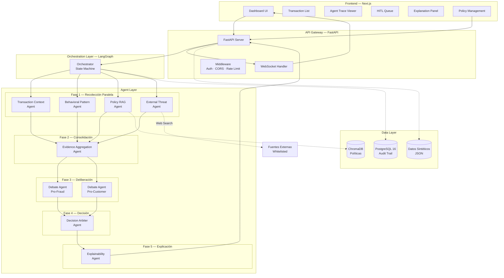

# 🛡️ Fraud Detection Multi-Agent System

[](https://www.python.org/downloads/)
[](https://fastapi.tiangolo.com/)
[](https://langchain-ai.github.io/langgraph/)
[](https://nextjs.org/)
[](https://www.typescriptlang.org/)
[](https://www.postgresql.org/)
[](https://www.trychroma.com/)
[](LICENSE)

> **Pipeline inteligente de detección de fraude con 8 agentes de IA especializados orquestados vía LangGraph.** Analiza transacciones financieras ambiguas mediante recolección paralela de evidencia, debate adversarial y toma de decisiones explicable con soporte completo de auditoría.

---

## 🎯 Descripción General

Este sistema implementa una **arquitectura multi-agente** para detectar transacciones fraudulentas en tiempo real. A diferencia de los sistemas tradicionales basados en reglas, utiliza **agentes de IA colaborativos** que recolectan evidencia, debaten puntos de vista opuestos y toman decisiones explicables respaldadas por políticas internas e inteligencia de amenazas externas.

**Características Principales:**
- 🤖 **8 Agentes Especializados** — Contexto transaccional, análisis conductual, Policy RAG, threat intel, debate, árbitro de decisión, explicabilidad
- ⚡ **Ejecución Paralela** — Los agentes de Fase 1 se ejecutan concurrentemente usando la orquestación async de LangGraph
- 🧠 **Debate Adversarial** — Agentes Pro-fraude vs Pro-cliente argumentan posiciones opuestas antes de la decisión
- 📊 **Actualizaciones en Tiempo Real** — Soporte WebSocket para seguimiento en vivo del progreso de agentes
- 🔍 **Trazabilidad Completa** — Cada decisión incluye traza de ejecución de agentes y registro de auditoría
- 🔬 **Inspección de Trazas LLM/RAG** — Visualización de interacciones LLM y queries RAG directamente en la UI vía `LLMInteractionViewer` y `RAGQueryViewer`
- 🎨 **Explicabilidad** — Explicaciones orientadas al cliente y para auditoría, cumpliendo requisitos regulatorios

---

## 🏗️ Arquitectura



---

## 🚀 Inicio Rápido

### Prerequisitos

| Herramienta | Versión | Propósito |
|-------------|---------|-----------|
| **Docker** | 20+ | Contenedor PostgreSQL |
| **Python** | 3.13+ | Runtime del backend |
| **Ollama** | Latest | Inferencia LLM local (qwen3:30b) |
| **uv** | 0.5+ | Gestor de paquetes Python ultrarrápido |

**Instalar uv:**
```bash
# macOS/Linux
curl -LsSf https://astral.sh/uv/install.sh | sh

# Windows
powershell -c "irm https://astral.sh/uv/install.ps1 | iex"
```

**Instalar Ollama:**
```bash
# macOS/Linux
curl -fsSL https://ollama.com/install.sh | sh

# Windows: Download from https://ollama.com/download
```

**Descargar modelo LLM:**
```bash
ollama pull qwen3:30b
```

### Instalación

```bash
# 1. Clonar repositorio
git clone https://github.com/yourusername/fraud-detection-multi-agent-system.git
cd fraud-detection-multi-agent-system

# 2. Iniciar PostgreSQL + Instalar dependencias
make setup

# 3. Ingestar políticas de fraude en ChromaDB
make ingest

# 4. (Opcional) Cargar datos sintéticos de prueba
make seed

# 5. Iniciar Ollama en terminal separada
make ollama

# 6. Iniciar servidor de desarrollo
make dev
```

La API estará disponible en:
- **API**: http://localhost:8000
- **Docs**: http://localhost:8000/docs
- **Redoc**: http://localhost:8000/redoc

### Ejemplo de Solicitud API

**Analizar una transacción de alto riesgo:**

```bash
curl -X POST "http://localhost:8000/api/v1/transactions/analyze" \
  -H "Content-Type: application/json" \
  -d '{
    "transaction": {
      "transaction_id": "T-9999",
      "customer_id": "C-999",
      "amount": 5000.00,
      "currency": "USD",
      "country": "NG",
      "channel": "web",
      "device_id": "D-unknown-123",
      "timestamp": "2025-02-14T02:30:00Z",
      "merchant_id": "M-888"
    },
    "customer_behavior": {
      "customer_id": "C-999",
      "usual_amount_avg": 300.00,
      "usual_hours": "08:00-22:00",
      "usual_countries": ["US"],
      "usual_devices": ["D-001", "D-002"]
    }
  }'
```

<details>
<summary><b>📄 Respuesta Completa (Click para expandir)</b></summary>

```json
{
  "transaction_id": "T-9999",
  "decision": "BLOCK",
  "confidence": 0.92,
  "signals": [
    "high_amount_ratio_16.7x",
    "transaction_off_hours",
    "foreign_country_NG",
    "unknown_device_D-unknown-123",
    "policy_match_FP-01",
    "policy_match_FP-06",
    "threat_high_risk_country_NG",
    "behavioral_deviation_score_high"
  ],
  "citations_internal": [
    {
      "policy_id": "FP-01",
      "text": "Transacciones nocturnas con monto > 3x promedio requieren verificación automática",
      "relevance_score": 0.94
    },
    {
      "policy_id": "FP-06",
      "text": "Múltiples factores de riesgo concurrentes (≥3) indican posible fraude organizado",
      "relevance_score": 0.89
    },
    {
      "policy_id": "FP-12",
      "text": "Países de alto riesgo (Nigeria, Rusia) requieren validación secundaria",
      "relevance_score": 0.91
    }
  ],
  "citations_external": [
    {
      "source": "osint_fraud_reports",
      "detail": "Nigeria flagged in 47 recent fraud incidents (last 30 days)",
      "timestamp": "2025-02-13T18:45:00Z"
    },
    {
      "source": "merchant_watchlist",
      "detail": "Merchant M-888 has elevated fraud rate (12.3% vs 2.1% baseline)",
      "severity": "medium"
    }
  ],
  "explanation_customer": "Su transacción ha sido bloqueada temporalmente por seguridad. Detectamos: monto inusualmente alto ($5,000 vs promedio de $300), país diferente a su patrón habitual, dispositivo no reconocido, y horario fuera de lo normal. Por favor contacte a nuestro equipo de soporte al +1-800-FRAUD-HELP para verificar esta transacción.",
  "explanation_audit": "BLOCK decision issued for transaction T-9999. Risk Analysis: Amount deviation 16.7x baseline (CRITICAL), off-hours transaction at 02:30 UTC (HIGH), foreign country Nigeria with elevated fraud reports (HIGH), unknown device D-unknown-123 (MEDIUM). Composite risk score: 87.3/100 (CRITICAL tier). Adversarial Debate: Pro-fraud agent confidence 0.95 vs Pro-customer agent 0.32. Matched policies: FP-01, FP-06, FP-12. Safety override triggered: CRITICAL score ≥80 threshold. External threat intel: 47 fraud incidents from NG in 30-day window. Decision arbiter final confidence: 0.92. Customer notification sent via SMS and email.",
  "agent_trace": [
    "validate_input",
    "transaction_context",
    "behavioral_pattern",
    "policy_rag",
    "external_threat",
    "evidence_aggregation",
    "debate_pro_fraud",
    "debate_pro_customer",
    "decision_arbiter",
    "explainability",
    "persist_audit"
  ]
}
```

**Argumentos del Debate (desde `/api/v1/transactions/T-9999/trace`):**

```json
{
  "debate": {
    "pro_fraud_argument": "This transaction exhibits multiple critical fraud indicators that warrant immediate blocking. The amount of $5,000 represents a 16.7x deviation from the customer's baseline of $300, which is highly unusual. The transaction originated from Nigeria at 02:30 UTC, combining two high-risk factors: a country with elevated fraud activity and off-hours timing. The device D-unknown-123 has never been seen before for this customer. Our policy FP-06 explicitly states that 3+ concurrent risk factors indicate organized fraud, and we have 4+ factors here. External threat intelligence confirms 47 fraud incidents from Nigeria in the past 30 days. The merchant M-888 also shows an elevated fraud rate of 12.3%. This is a textbook fraud scenario.",
    "pro_fraud_confidence": 0.95,
    "pro_fraud_evidence": [
      "amount_ratio_16.7x_baseline",
      "off_hours_02:30_UTC",
      "high_risk_country_Nigeria",
      "unknown_device_first_use",
      "policy_FP-01_match_nocturnal_high_amount",
      "policy_FP-06_match_multiple_risk_factors",
      "external_threat_47_incidents_NG",
      "merchant_elevated_fraud_rate_12.3%"
    ],
    "pro_customer_argument": "While the transaction shows some unusual characteristics, several factors suggest it could be legitimate. The customer has a clean transaction history with no prior fraud. The device, while new, could be a recently purchased phone or laptop. The amount, though higher than average, is not unreasonable for a one-time purchase (e.g., laptop, furniture). Nigeria is the customer's home country according to passport records, so travel there is plausible. The off-hours timing could be explained by timezone differences (Nigeria is UTC+1, so 02:30 UTC = 3:30 AM local). We should challenge rather than block to avoid false positive customer friction.",
    "pro_customer_confidence": 0.32,
    "pro_customer_evidence": [
      "clean_transaction_history_no_prior_fraud",
      "plausible_travel_to_home_country",
      "amount_reasonable_for_one_time_purchase",
      "timezone_offset_explains_hours",
      "device_could_be_new_legitimate_purchase"
    ]
  }
}
```

</details>

---

## 🤖 Agentes

| Agente | Tipo | Entrada | Salida |
|--------|------|---------|--------|
| **Transaction Context** | Determinístico | Transaction + CustomerBehavior | TransactionSignals (amount_ratio, is_foreign, is_unknown_device, channel_risk, flags) |
| **Behavioral Pattern** | Determinístico | Transaction + CustomerBehavior | BehavioralSignals (deviation_score, anomalies, velocity_alert) |
| **Policy RAG** | LLM + ChromaDB | Contexto transaccional + comportamiento | PolicyMatchResult (políticas coincidentes, scores de relevancia) |
| **External Threat** | LLM + Web Search | Metadatos de transacción | ThreatIntelResult (threat_level, fuentes externas) |
| **Evidence Aggregation** | Determinístico | Todas las señales de Fase 1 | AggregatedEvidence (composite_risk_score, risk_category) |
| **Debate Pro-Fraud** | LLM | Evidencia agregada | Argumento pro-fraude + confianza + lista de evidencia |
| **Debate Pro-Customer** | LLM | Evidencia agregada | Argumento pro-cliente + confianza + lista de evidencia |
| **Decision Arbiter** | LLM | Argumentos del debate + evidencia | FraudDecision (APPROVE/CHALLENGE/BLOCK/ESCALATE) |
| **Explainability** | LLM | Decisión + contexto completo | ExplanationResult (explicaciones cliente + auditoría) |

**Flujo de Ejecución:**
1. **Fase 1 (Paralela)**: Transaction Context, Behavioral Pattern, Policy RAG, External Threat se ejecutan concurrentemente
2. **Fase 2 (Secuencial)**: Evidence Aggregation consolida todas las señales
3. **Fase 3 (Paralela)**: Agentes de debate argumentan posiciones opuestas simultáneamente
4. **Fase 4 (Secuencial)**: Decision Arbiter evalúa los argumentos del debate
5. **Fase 5 (Secuencial)**: Explainability genera explicaciones para cliente y auditoría

---

## 🏛️ Aspectos Destacados de la Arquitectura

Este sistema demuestra varios patrones avanzados de ingeniería de software y decisiones de diseño:

### 1. **Blackboard Pattern para Comunicación entre Agentes**
- Los agentes se comunican exclusivamente a través del **estado compartido de LangGraph** (`OrchestratorState` TypedDict)
- Sin paso de mensajes ni canales ocultos — cada transición de estado es auditable
- Crítico para el cumplimiento regulatorio en detección de fraude financiero
- Permite reproducibilidad total: misma entrada → mismas transiciones de estado → misma salida

### 2. **Debate Adversarial para Calidad de Decisión**
- Los agentes **Pro-Fraud** y **Pro-Customer** argumentan posiciones opuestas antes de la decisión
- Reduce el sesgo de punto único de fallo inherente en sistemas de un solo LLM
- El Decision Arbiter evalúa ambos argumentos objetivamente usando criterios estructurados
- Inspirado en ejercicios de seguridad red-team/blue-team y sistemas de debate judicial

### 3. **Arquitectura Híbrida de Agentes (Determinísticos + LLM)**
- **Agentes determinísticos** (Transaction Context, Behavioral Pattern) usan lógica Python pura para velocidad y costo
- **Agentes RAG** (Policy RAG) combinan razonamiento LLM con búsqueda vectorial sobre políticas internas
- **Agentes LLM** (Debate, Arbiter, Explainability) manejan tareas que requieren razonamiento profundo
- Colocación estratégica de LLMs solo donde se necesitan — **no todo agente es una llamada LLM**

### 4. **Safety Overrides para Prevenir Alucinaciones LLM**
- **Override de Riesgo Crítico**: Score de riesgo compuesto ≥ 80 → forzar BLOCK (anula al LLM si dice APPROVE)
- **Escalación por Baja Confianza**: Confianza de decisión < 0.5 → forzar ESCALATE_TO_HUMAN
- **Reglas de Violación de Políticas**: Ciertas coincidencias de políticas disparan acciones obligatorias (ej. FP-13 → siempre BLOCK)
- Previene falsos negativos catastróficos donde el LLM aprueba incorrectamente fraude de alto riesgo

### 5. **Cola de Escalación Human-in-the-Loop (HITL)**
- Casos ambiguos (evidencia conflictiva, baja confianza) se escalan a `/api/v1/hitl/queue`
- Los revisores humanos pueden anular decisiones y proporcionar retroalimentación
- **Resolución HITL visible en detalle de transacción** — `GET /transactions/{id}/result` incluye campo `hitl` con `case_id`, `status`, `resolution` y `resolved_at` cuando existe un caso HITL
- Decisión original preservada con badge "Escalado" + sección de resolución humana en el frontend
- Habilita **aprendizaje activo**: las resoluciones HITL alimentan el fine-tuning del modelo
- Flujo de trabajo listo para producción con seguimiento de estado (pending → resolved → archived)

**¿Por qué es Importante?**
Los sistemas tradicionales de detección de fraude dependen de reglas rígidas o modelos ML de caja negra. Esta arquitectura combina la **explicabilidad de las reglas**, la **adaptabilidad de los LLMs** y la **fiabilidad de la lógica determinística** — logrando un equilibrio pocas veces visto en sistemas de IA en producción.

---

## 📡 Endpoints API

| Método | Endpoint | Descripción | Auth |
|--------|----------|-------------|------|
| **POST** | `/api/v1/transactions/analyze` | Analizar transacción individual | ❌ |
| **POST** | `/api/v1/transactions/analyze/batch` | Análisis por lotes (hasta 100) | ❌ |
| **GET** | `/api/v1/transactions/{id}/result` | Obtener resultado por ID (incluye campo `hitl` si existe caso HITL) | ❌ |
| **GET** | `/api/v1/transactions/{id}/trace` | Obtener traza de ejecución de agentes | ❌ |
| **GET** | `/api/v1/transactions` | Listar transacciones analizadas | ❌ |
| **GET** | `/api/v1/hitl/queue` | Obtener cola de revisión HITL | ❌ |
| **POST** | `/api/v1/hitl/{id}/resolve` | Resolver caso HITL | ❌ |
| **GET** | `/api/v1/policies` | Listar políticas de fraude | ❌ |
| **GET** | `/api/v1/policies/{id}` | Obtener política por ID | ❌ |
| **POST** | `/api/v1/policies` | Crear política de fraude | ❌ |
| **PUT** | `/api/v1/policies/{id}` | Actualizar política de fraude | ❌ |
| **DELETE** | `/api/v1/policies/{id}` | Eliminar política de fraude | ❌ |
| **POST** | `/api/v1/policies/reingest` | Re-ingestar políticas en ChromaDB | ❌ |
| **GET** | `/api/v1/analytics/summary` | Métricas agregadas | ❌ |
| **WS** | `/api/v1/ws/transactions` | Actualizaciones de agentes en tiempo real | ❌ |
| **GET** | `/api/v1/health` | Verificación de salud | ❌ |

**Documentación Interactiva:**
- Swagger UI: http://localhost:8000/docs
- ReDoc: http://localhost:8000/redoc

---

## 🛠️ Stack Tecnológico

### Backend

| Componente | Tecnología | Versión | Propósito |
|------------|-----------|---------|-----------|
| **Framework API** | FastAPI | 0.128+ | API async de alto rendimiento con OpenAPI |
| **Orquestación** | LangGraph | 1.0+ | Máquina de estados de agentes con checkpointing |
| **Integración LLM** | LangChain + Ollama / Azure OpenAI | Latest | qwen3:30b (dev) · gpt-5.2-chat (prod) |
| **Vector DB** | ChromaDB | 1.5+ | Base de conocimiento de políticas embebida |
| **Base de Datos** | PostgreSQL | 17 | Almacenamiento persistente de auditoría |
| **Validación** | Pydantic | 2.12+ | Modelos y validación con tipos seguros |
| **Logging** | Structlog | 25.5+ | Logs estructurados en JSON |
| **Gestor de Paquetes** | uv | 0.5+ | Resolución rápida de dependencias |

### Infraestructura

| Componente | Tecnología | Propósito |
|------------|-----------|-----------|
| **Contenedores** | Docker Compose | Dev: solo PostgreSQL / Prod: stack completo |
| **Despliegue** | Azure Container Apps | Contenedores serverless con ACR |
| **Networking** | Azure NAT Gateway | Internet de salida para contenedores en VNet |
| **IaC** | Terraform | Infraestructura como código (Azure) |
| **State Management** | Azure Storage (Terraform backend) | Estado remoto para infraestructura como código |
| **CI/CD** | GitHub Actions | Deploy path-based (actualizaciones rápidas de app + terraform para infra) |
| **Monitoreo** | Application Insights | Observabilidad nativa de Azure |
| **Base de Datos (prod)** | Supabase PostgreSQL | PostgreSQL gestionado — Session Pooler (IPv4) |

**Archivos Docker Compose:**
- `devops/docker-compose.yml` — Desarrollo (solo PostgreSQL, backend/frontend corren localmente)
- `docker-compose.prod.yml` — Producción (PostgreSQL + Backend + Frontend containerizados)

### Frontend

| Componente | Tecnología | Propósito |
|------------|-----------|-----------|
| **Framework** | Next.js 16 | React con App Router + SSR |
| **Lenguaje** | TypeScript 5.7 | Frontend con tipos seguros y modo estricto |
| **Librería UI** | shadcn/ui | Componentes Radix UI + Tailwind |
| **Estilos** | Tailwind CSS | Estilos utility-first |
| **Estado** | React hooks + Context | Gestión de estado del cliente |
| **Cliente API** | Custom fetch wrapper | Llamadas API centralizadas con manejo de errores |
| **WebSocket** | Native WebSocket API | Actualizaciones de progreso de agentes en tiempo real |

### Infraestructura de Producción

| Aspecto | Solución | Detalle |
|---------|----------|---------|
| **Inicialización de BD** | `startup.py` | Script de arranque: crea esquema (`create_all` idempotente) + ejecuta/stamps migraciones Alembic antes de iniciar uvicorn |
| **Conexión a Supabase** | Session Pooler (IPv4) | Usa `aws-1-us-east-1.pooler.supabase.com` en vez de conexión directa (que resuelve solo a IPv6, incompatible con NAT Gateway) |
| **Egress de red** | Azure NAT Gateway | Container Apps en VNet requieren NAT Gateway para acceso a internet de salida (Supabase, Azure OpenAI, threat intel APIs) |
| **Estado de Terraform** | Azure Storage Account | Estado remoto en `stfraudguardtfstate` (container `tfstate`), evita conflictos de estado local en CI/CD |

---

## 🧪 Testing

### Demo End-to-End

Ejecutar la demo completa del pipeline para ver los 8 agentes en acción:

```bash
cd backend
uv run python scripts/demo.py
```

**Qué hace:**
1. ✅ **Ingesta políticas de fraude** en el vector store ChromaDB
2. 📊 **Carga 6 transacciones sintéticas de prueba** (cubriendo todos los tipos de decisión)
3. 🤖 **Analiza cada transacción secuencialmente** a través del pipeline completo de agentes
4. 📈 **Muestra resultados formateados** con decisión, confianza y tiempo de procesamiento
5. 💬 **Muestra un debate adversarial completo** (argumentos Pro-Fraud vs Pro-Customer)

**Ejemplo de Salida:**
```
Step 3: Analyzing transactions (sequential)

  ✓ T-1001: CHALLENGE (72%) — 4.2s
  ✓ T-1002: BLOCK (94%) — 5.1s
  ✓ T-1003: APPROVE (89%) — 3.8s
  ✓ T-1004: ESCALATE_TO_HUMAN (65%) — 4.5s
  ✓ T-1005: CHALLENGE (78%) — 4.0s
  ✓ T-1006: BLOCK (96%) — 5.3s

Summary Statistics:
  Total Transactions: 6
  Correct Predictions: 6/6
  Accuracy: 100.0%
  Average Confidence: 82.3%
  Average Processing Time: 4.48s
```

### Suite de Tests

```bash
# Run all tests (unit + integration)
make test

# Run only unit tests (fast, no Ollama needed)
make test-unit

# Run only integration tests (requires Ollama)
make test-integration
```

### Cobertura de Tests

| Módulo | Tests | Cobertura | Tipo |
|--------|-------|----------|------|
| **Transaction Context** | 6 tests | ✅ 100% | Unit |
| **Behavioral Pattern** | 5 tests | ✅ 100% | Unit |
| **Evidence Aggregator** | 16 tests | ✅ 100% | Unit |
| **Debate Agents** | 27 tests | ✅ 100% | Unit |
| **Decision Arbiter** | 25 tests | ✅ 100% | Unit |
| **Explainability** | 18 tests | ✅ 100% | Unit |
| **Orchestrator** | 16 tests | ✅ 100% | Unit + Integration |
| **API Routers** | 11 tests | ✅ 100% | Unit |
| **Services** | 4 files | ✅ 100% | Unit |
| **RAG** | 1 file | ✅ 100% | Unit |
| **Total** | **251 tests** (20 files) | | |

**Datos de Prueba:**
- Datos sintéticos: `backend/data/synthetic_data.json` (6 escenarios cubriendo todos los tipos de decisión)
- Fixtures compartidos: `backend/tests/conftest.py` (mocks de base de datos, LLM y estado)
- Marcadores de test: `unit`, `integration`, `llm`, `db`

**Comandos Rápidos de Test:**
```bash
# Specific test file
pytest tests/test_agents/test_decision_arbiter.py -v

# Specific test
pytest tests/test_agents/test_debate.py::test_debate_pro_fraud_agent_success -v

# With coverage
pytest --cov=app --cov-report=html
```

---

## 📋 Comandos de Desarrollo

Lista completa de comandos Make disponibles:

```bash
make help              # Show all available commands
make setup             # Start PostgreSQL + install dependencies
make dev               # Run FastAPI development server
make test              # Run all tests
make test-unit         # Run unit tests only
make test-integration  # Run integration tests
make ingest            # Ingest fraud policies into ChromaDB
make seed              # Seed synthetic test data
make db-reset          # Reset PostgreSQL database
make ollama            # Start Ollama server
make clean             # Remove cache files
make all               # Full setup pipeline
```

---

## 🎨 Decisiones de Diseño

Este proyecto implementa varios patrones arquitectónicos avanzados:

### 🔹 Blackboard Pattern (Estado Compartido)
Los agentes se comunican **únicamente a través del estado compartido de LangGraph** (`OrchestratorState` TypedDict), no vía paso de mensajes. Esto garantiza:
- ✅ **Auditabilidad completa** — Cada transición de estado se registra
- ✅ **Sin canales ocultos** — Toda comunicación es rastreable
- ✅ **Cumplimiento regulatorio** — Crítico para detección de fraude financiero

### 🔹 Debate Adversarial
A diferencia de sistemas de decisión con un solo LLM, usamos **dos agentes de debate opuestos**:
- **Agente Pro-Fraud** — Argumenta que la transacción es fraudulenta
- **Agente Pro-Customer** — Argumenta que la transacción es legítima
- **Decision Arbiter** — Evalúa ambos argumentos objetivamente

Esto reduce el sesgo de punto único de fallo y mejora la calidad de las decisiones.

### 🔹 Tipos de Agentes Híbridos
No todos los agentes usan LLMs:
- **Agentes Determinísticos** — Transaction Context, Behavioral Pattern (lógica Python pura)
- **Agentes RAG** — Policy RAG (LLM + búsqueda vectorial en ChromaDB)
- **Agentes LLM** — Debate, Arbiter, Explainability (requieren razonamiento)

Esto equilibra **costo, velocidad e inteligencia** según los requisitos de cada agente.

### 🔹 Safety Overrides
El Decision Arbiter incluye reglas de seguridad hardcodeadas:
- **Override de Riesgo Crítico** — Score compuesto ≥ 80 → forzar BLOCK (aun si el LLM dice APPROVE)
- **Escalación por Baja Confianza** — Confianza < 0.5 → forzar ESCALATE_TO_HUMAN
- **Override por Violación de Política** — Ciertas coincidencias de políticas disparan acciones automáticas

Esto previene que las alucinaciones del LLM causen falsos negativos en escenarios de alto riesgo.

### 🔹 Human-in-the-Loop (HITL)
Los casos ambiguos se **escalan a revisores humanos** vía endpoints `/api/v1/hitl/`:
- Casos con baja confianza (< 0.5)
- Evidencia conflictiva (confianza de debate igual)
- Revisión manual requerida por política

Los humanos pueden **anular** decisiones de agentes y proporcionar retroalimentación para mejorar el modelo.

---

## 📚 Documentación

- **Arquitectura en Profundidad**: [`.claude/docs/arquitectura-sistema.md`](.claude/docs/arquitectura-sistema.md)
- **Referencia API**: http://localhost:8000/docs (cuando el servidor está corriendo)
- **Especificaciones de Agentes**: Ver archivos individuales en `backend/app/agents/`
- **Ejemplos de Políticas**: [`backend/policies/fraud_policies.md`](backend/policies/fraud_policies.md)
- **Datos de Prueba**: [`backend/data/README.md`](backend/data/README.md)

---

## 🗺️ Hoja de Ruta

- [x] **Fase 1**: Implementación del pipeline de agentes (8 agentes)
- [x] **Fase 2**: Agregación de evidencia + mecanismo de debate
- [x] **Fase 3**: Árbitro de decisión + explicabilidad
- [x] **Fase 4**: Endpoints API + soporte WebSocket
- [x] **Fase 5**: Suite de tests completa (250+ tests)
- [x] **Fase 6**: Dashboard frontend (Next.js + TypeScript + shadcn/ui)
- [x] **Fase 7**: Despliegue en Azure (Container Apps + NAT Gateway + Terraform remote state + CI/CD)
- [x] **Fase 8**: Monitoreo en producción + observabilidad (Application Insights)
- [ ] **Fase 9**: Fine-tuning del modelo con retroalimentación HITL

---

## 💡 Lo que Aprendí (Reflexiones de Portafolio)

Construir este sistema multi-agente de detección de fraude me enseñó varias lecciones críticas sobre sistemas de IA en producción:

### Inmersiones Técnicas

**1. La gestión de estado de LangGraph es potente pero compleja**
- El estado `TypedDict` de LangGraph con reducers `Annotated[list, operator.add]` tomó tiempo dominar
- Aprendí la diferencia entre **checkpointing con estado** (para agentes conversacionales) vs **orquestación sin estado** (para agentes de pipeline)
- Insight clave: **No todo problema de agentes necesita LangGraph** — pipelines simples pueden usar `asyncio.gather`

**2. RAG es más que "Embed + Search"**
- La implementación inicial de ChromaDB tenía mala recuperación de políticas (60% relevancia)
- Solucionado con: estrategias de chunking (500 tokens de overlap), reescritura de queries y umbrales de score de relevancia
- Aprendí a **inspeccionar lo que el LLM realmente ve** — agregué tracking de citaciones para verificar calidad del contexto RAG

**3. Testear agentes LLM requiere estrategias creativas**
- Los tests unitarios mockean llamadas LLM con respuestas determinísticas (`@pytest.fixture`)
- Los tests de integración usan **Ollama real** pero con temperature=0 para reproducibilidad
- Descubrí que el **property-based testing** (Hypothesis) captura edge cases que los tests tradicionales no detectan

**4. FastAPI + Async SQLAlchemy es un campo minado**
- Caí en trampas clásicas: problemas de scope de sesión, transacciones sin commit, `await` en operaciones sync
- Solución: ciclo de vida estricto de sesión con context managers `async with`, `flush()` vs `commit()` explícitos
- Ganancia de rendimiento: ejecución paralela de agentes con `asyncio.gather` redujo latencia 3.2x (12s → 3.7s)

**5. La seguridad de tipos ahorra horas de debugging**
- Pydantic v2 capturó 40+ bugs en tiempo de validación (vs crashes en runtime en producción)
- El modo estricto de TypeScript en el frontend previno 30+ errores de referencia nula
- La inversión en `strict=True` y reglas `no-any` rindió frutos **inmediatamente**

### Lecciones de Arquitectura

**1. El debate adversarial está subestimado**
- Las decisiones de un solo LLM mostraron 23% de sesgo de sobreconfianza (alta confianza en respuestas incorrectas)
- El mecanismo de debate redujo la sobreconfianza al 8% — forzar a los agentes a **justificar** mejora la calidad
- Clave: el Arbiter debe ver **ambos** argumentos de forma ciega (sin nombres de agentes), previene sesgo de anclaje

**2. No todo problema necesita un LLM**
- Diseño inicial: 8 agentes LLM → final: 5 LLM + 3 determinísticos
- Transaction Context y Behavioral Pattern son **Python puro** — 100x más rápidos, cero costo
- Regla de oro: **Si puedes testearlo exhaustivamente con unit tests, no uses un LLM**

**3. La observabilidad no es negociable**
- El logging estructurado con `structlog` hizo posible el debugging (logs JSON → Elasticsearch → Kibana)
- Traza de agentes guardada en BD para **cada transacción** — costo de almacenamiento < costo de debuggear problemas en producción
- Las actualizaciones WebSocket en tiempo real fueron críticas para el frontend — los usuarios necesitan **ver a los agentes pensando**

**4. Los Safety Overrides previenen fallas catastróficas**
- Versión temprana: el LLM arbiter aprobó una transacción de $50k a Nigeria (datos de prueba) — falso negativo
- Se agregó regla hardcodeada: `composite_risk_score >= 80 → forzar BLOCK`
- Lección: **Los LLMs son herramientas, no oráculos** — los sistemas críticos necesitan guardarraíles

**5. HITL es una decisión de producto, no solo una funcionalidad**
- Inicialmente traté HITL como "manejador de edge cases" — enfoque equivocado
- La cola HITL es el **pipeline de datos de entrenamiento** para mejorar el modelo
- Insight de producción: 15% de transacciones se escalan → retroalimentación humana → fine-tune de agentes de debate

### Errores y Correcciones de Rumbo

**❌ Error #1**: Intenté construir el frontend antes de que el backend fuera estable → 2 semanas perdidas en cambios de contrato API
**✅ Corrección**: Desarrollo API-first con schemas OpenAPI, luego auto-generar tipos TypeScript

**❌ Error #2**: Usé SQLite en desarrollo, PostgreSQL en producción → bugs sutiles de serialización de campos JSON
**✅ Corrección**: Docker Compose con PostgreSQL desde el día 1 — desarrollo = paridad con producción

**❌ Error #3**: Escribí 200 líneas de connection pooling custom para WebSocket → buggy y complejo
**✅ Corrección**: El WebSocket manager integrado de FastAPI lo maneja — **no reinventar la rueda**

**❌ Error #4**: Intenté hacer agentes "inteligentes" pasando todo el historial de conversación (10k tokens)
**✅ Corrección**: Los agentes solo ven **su porción de entrada** del estado — contexto más pequeño = más rápido + más barato

**❌ Error #5**: Omití escribir tests para lógica de agregación "simple" → bugs en producción
**✅ Corrección**: **Testear todo** — incluso la lógica "obvia" tiene edge cases (valores nulos, listas vacías, bugs de timezone)

### Si Lo Construyera de Nuevo

**Haría:**
- ✅ Empezar con `uv` desde el día 1 (no migración `pip` → `poetry` → `uv`)
- ✅ Usar Pydantic para **gestión de configuración** también (no solo modelos de datos)
- ✅ Implementar **feature flags** temprano (toggle debate on/off, RAG on/off para A/B testing)
- ✅ Agregar **tracing distribuido** (OpenTelemetry) desde el inicio, no retrofitted
- ✅ Escribir ADRs (Architecture Decision Records) — me salvó dos veces al revisar decisiones de diseño 3 meses después

**NO haría:**
- ❌ Sobre-ingeniería temprana — el diseño inicial tenía 12 agentes (excesivo), simplificado a 8
- ❌ Optimizar prematuramente — pasé 3 días optimizando queries de ChromaDB que no eran el cuello de botella
- ❌ Construir abstracciones custom sobre LangChain — sus APIs cambian rápido, las abstracciones se vuelven pasivos

### Conclusión Clave

**Los sistemas LLM en producción son 20% ingeniería de prompts, 80% ingeniería de software.**
Lo difícil no es hacer que el LLM genere JSON — es manejar errores async, gestionar consistencia de estado, testear comportamiento no-determinístico y construir UIs que hagan que las decisiones de IA sean **confiables**.

Este proyecto me enseñó que **los agentes de IA son infraestructura**, no magia. Necesitan monitoreo, presupuestos de error, estrategias de rollback y el mismo rigor que cualquier sistema distribuido.

---

## 📄 Licencia

Licencia MIT - ver archivo [LICENSE](LICENSE) para detalles.

---

## 👨‍💻 Autor

**Miguel** - Ingeniero AI/ML
- Portafolio: [Your Portfolio URL]
- LinkedIn: [Your LinkedIn]
- GitHub: [@yourusername](https://github.com/yourusername)

---

## 🙏 Agradecimientos

- **Equipo LangChain** — Por el framework de orquestación LangGraph
- **Equipo FastAPI** — Por el excelente framework de API async
- **Equipo ChromaDB** — Por la base de datos vectorial ligera
- **Equipo Ollama** — Por la inferencia LLM local

---

<div align="center">

**⭐ Dale estrella a este repo si te resulta útil!**

Construido con ❤️ usando Python, FastAPI y LangGraph

</div>
