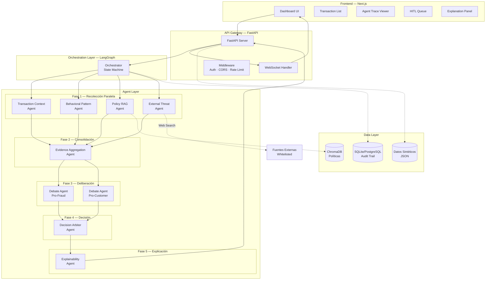

# 🛡️ Fraud Detection Multi-Agent System

[](https://www.python.org/downloads/)
[](https://fastapi.tiangolo.com/)
[](https://langchain-ai.github.io/langgraph/)
[](https://www.postgresql.org/)
[](https://www.trychroma.com/)
[](LICENSE)

> **An intelligent fraud detection pipeline using 8 specialized AI agents orchestrated via LangGraph.** Analyzes ambiguous financial transactions through parallel evidence collection, adversarial debate, and explainable decision-making with full audit trail support.

---

## 🎯 Overview

This system implements a **multi-agent architecture** for detecting fraudulent transactions in real-time. Unlike traditional rule-based systems, it uses **collaborative AI agents** that collect evidence, debate opposing viewpoints, and make explainable decisions backed by internal policies and external threat intelligence.

**Key Features:**
- 🤖 **8 Specialized Agents** — Transaction context, behavioral analysis, policy RAG, threat intel, debate, decision arbiter, explainability
- ⚡ **Parallel Execution** — Phase 1 agents run concurrently using LangGraph's async orchestration
- 🧠 **Adversarial Debate** — Pro-fraud vs Pro-customer agents argue opposing positions before decision
- 📊 **Real-time Updates** — WebSocket support for live agent progress tracking
- 🔍 **Full Traceability** — Every decision includes agent execution trace and audit trail
- 🎨 **Explainability** — Customer-facing and audit explanations for regulatory compliance

---

## 🏗️ Architecture



---

## 🚀 Quick Start

### Prerequisites

| Tool | Version | Purpose |
|------|---------|---------|
| **Docker** | 20+ | PostgreSQL container |
| **Python** | 3.13+ | Backend runtime |
| **Ollama** | Latest | Local LLM inference (llama3.2) |
| **uv** | 0.5+ | Fast Python package manager |

**Install uv:**
```bash
# macOS/Linux
curl -LsSf https://astral.sh/uv/install.sh | sh

# Windows
powershell -c "irm https://astral.sh/uv/install.ps1 | iex"
```

**Install Ollama:**
```bash
# macOS/Linux
curl -fsSL https://ollama.com/install.sh | sh

# Windows: Download from https://ollama.com/download
```

**Pull LLM model:**
```bash
ollama pull llama3.2
```

### Installation

```bash
# 1. Clone repository
git clone https://github.com/yourusername/fraud-detection-multi-agent-system.git
cd fraud-detection-multi-agent-system

# 2. Start PostgreSQL + Install dependencies
make setup

# 3. Ingest fraud policies into ChromaDB
make ingest

# 4. (Optional) Seed synthetic test data
make seed

# 5. Start Ollama in separate terminal
make ollama

# 6. Start development server
make dev
```

The API will be available at:
- **API**: http://localhost:8000
- **Docs**: http://localhost:8000/docs
- **Redoc**: http://localhost:8000/redoc

### Example Request

**Analyze a transaction:**

```bash
curl -X POST "http://localhost:8000/api/v1/transactions/analyze" \
  -H "Content-Type: application/json" \
  -d '{
    "transaction": {
      "transaction_id": "T-9999",
      "customer_id": "C-999",
      "amount": 5000.00,
      "currency": "USD",
      "country": "NG",
      "channel": "web",
      "device_id": "D-unknown-123",
      "timestamp": "2025-02-11T02:30:00Z",
      "merchant_id": "M-888"
    },
    "customer_behavior": {
      "customer_id": "C-999",
      "usual_amount_avg": 300.00,
      "usual_hours": "08:00-22:00",
      "usual_countries": ["US"],
      "usual_devices": ["D-001", "D-002"]
    }
  }'
```

**Example Response:**

```json
{
  "transaction_id": "T-9999",
  "decision": "BLOCK",
  "confidence": 0.92,
  "signals": [
    "high_amount_ratio_16.7x",
    "transaction_off_hours",
    "foreign_country_NG",
    "unknown_device_D-unknown-123",
    "policy_match_FP-01",
    "threat_high_risk_country_NG"
  ],
  "citations_internal": [
    {
      "policy_id": "FP-01",
      "text": "Transacciones con monto > 3x promedio requieren verificación inmediata"
    },
    {
      "policy_id": "FP-06",
      "text": "Múltiples factores de riesgo concurrentes indican fraude organizado"
    }
  ],
  "citations_external": [
    {
      "source": "high_risk_country_NG",
      "detail": "Nigeria flagged in recent fraud reports (OSINT)"
    }
  ],
  "explanation_customer": "Su transacción ha sido bloqueada por seguridad debido a: monto inusualmente alto (16.7x su promedio), país no habitual (Nigeria), dispositivo desconocido y horario fuera de lo normal. Por favor contacte a soporte.",
  "explanation_audit": "BLOCK decision based on: extreme amount deviation (16.7x baseline), high-risk country (NG), unknown device, off-hours timing. Composite risk score: 87.3/100 (CRITICAL). Debate confidence: Pro-fraud 0.95, Pro-customer 0.32. Safety override: Critical score threshold exceeded.",
  "agent_trace": [
    "transaction_context",
    "behavioral_pattern",
    "policy_rag",
    "external_threat",
    "evidence_aggregation",
    "debate_pro_fraud",
    "debate_pro_customer",
    "decision_arbiter",
    "explainability"
  ]
}
```

---

## 🤖 Agents

| Agent | Type | Input | Output |
|-------|------|-------|--------|
| **Transaction Context** | Deterministic | Transaction + CustomerBehavior | TransactionSignals (amount_ratio, is_off_hours, flags) |
| **Behavioral Pattern** | Deterministic | Transaction + CustomerBehavior | BehavioralSignals (deviation_score, anomalies, velocity_alert) |
| **Policy RAG** | LLM + ChromaDB | Transaction context + behavior | PolicyMatchResult (matching policies, relevance scores) |
| **External Threat** | LLM + Web Search | Transaction metadata | ThreatIntelResult (threat_level, external sources) |
| **Evidence Aggregation** | Deterministic | All signals from Phase 1 | AggregatedEvidence (composite_risk_score, risk_category) |
| **Debate Pro-Fraud** | LLM | Aggregated evidence | Pro-fraud argument + confidence + evidence list |
| **Debate Pro-Customer** | LLM | Aggregated evidence | Pro-customer argument + confidence + evidence list |
| **Decision Arbiter** | LLM | Debate arguments + evidence | FraudDecision (APPROVE/CHALLENGE/BLOCK/ESCALATE) |
| **Explainability** | LLM | Decision + full context | ExplanationResult (customer + audit explanations) |

**Execution Flow:**
1. **Phase 1 (Parallel)**: Transaction Context, Behavioral Pattern, Policy RAG, External Threat run concurrently
2. **Phase 2 (Sequential)**: Evidence Aggregation consolidates all signals
3. **Phase 3 (Parallel)**: Debate agents argue opposing positions simultaneously
4. **Phase 4 (Sequential)**: Decision Arbiter evaluates debate arguments
5. **Phase 5 (Sequential)**: Explainability generates customer/audit explanations

---

## 📡 API Endpoints

| Method | Endpoint | Description | Auth |
|--------|----------|-------------|------|
| **POST** | `/api/v1/transactions/analyze` | Analyze single transaction | ❌ |
| **POST** | `/api/v1/transactions/analyze/batch` | Batch analysis (up to 100) | ❌ |
| **GET** | `/api/v1/transactions/{id}/result` | Get analysis result by ID | ❌ |
| **GET** | `/api/v1/transactions/{id}/trace` | Get agent execution trace | ❌ |
| **GET** | `/api/v1/transactions` | List analyzed transactions | ❌ |
| **GET** | `/api/v1/hitl/queue` | Get HITL review queue | ❌ |
| **POST** | `/api/v1/hitl/{id}/resolve` | Resolve HITL case | ❌ |
| **GET** | `/api/v1/analytics/summary` | Aggregated metrics | ❌ |
| **WS** | `/api/v1/ws/transactions` | Real-time agent updates | ❌ |
| **GET** | `/api/v1/health` | Health check | ❌ |

**Interactive Documentation:**
- Swagger UI: http://localhost:8000/docs
- ReDoc: http://localhost:8000/redoc

---

## 🛠️ Tech Stack

### Backend

| Component | Technology | Version | Purpose |
|-----------|-----------|---------|---------|
| **API Framework** | FastAPI | 0.128+ | High-performance async API with OpenAPI |
| **Orchestration** | LangGraph | 1.0+ | Agent state machine with checkpointing |
| **LLM Integration** | LangChain + Ollama | Latest | Local LLM inference (llama3.2) |
| **Vector DB** | ChromaDB | 1.5+ | Embedded policy knowledge base |
| **Database** | PostgreSQL | 17 | Persistent audit trail storage |
| **Validation** | Pydantic | 2.12+ | Type-safe models and validation |
| **Logging** | Structlog | 25.5+ | Structured JSON logging |
| **Package Manager** | uv | 0.5+ | Fast dependency resolution |

### Infrastructure

| Component | Technology | Purpose |
|-----------|-----------|---------|
| **Containerization** | Docker Compose | PostgreSQL orchestration |
| **Deployment** | Azure Container Apps (planned) | Serverless containers |
| **IaC** | Terraform (planned) | Infrastructure as code |
| **Monitoring** | (planned) | Observability stack |

### Frontend (Planned)

| Component | Technology | Purpose |
|-----------|-----------|---------|
| **Framework** | Next.js 14 | React with SSR/SSG |
| **Language** | TypeScript | Type-safe frontend |
| **Styling** | Tailwind CSS | Utility-first styling |
| **State** | React Query | Server state management |
| **WebSocket** | Socket.io | Real-time updates |

---

## 🧪 Testing

### Test Suite

```bash
# Run all tests (unit + integration)
make test

# Run only unit tests (fast, no Ollama needed)
make test-unit

# Run only integration tests (requires Ollama)
make test-integration
```

### Test Coverage

| Module | Tests | Coverage | Type |
|--------|-------|----------|------|
| **Transaction Context** | 6 tests | ✅ 100% | Unit |
| **Behavioral Pattern** | 5 tests | ⏳ Pending | Unit (skipped) |
| **Evidence Aggregator** | 16 tests | ✅ 100% | Unit |
| **Debate Agents** | 27 tests | ✅ 100% | Unit |
| **Decision Arbiter** | 25 tests | ✅ 100% | Unit |
| **Explainability** | 18 tests | ✅ 100% | Unit |
| **Orchestrator** | 16 tests | ✅ 100% | Unit + Integration |
| **API Routers** | 11 tests | ✅ 100% | Unit |

**Test Data:**
- Synthetic test data: `backend/data/synthetic_data.json` (6 scenarios covering all decision types)
- Shared fixtures: `backend/tests/conftest.py` (database mocks, LLM mocks, state fixtures)
- Test markers: `unit`, `integration`, `llm`, `db`

**Quick Test Commands:**
```bash
# Specific test file
pytest tests/test_agents/test_decision_arbiter.py -v

# Specific test
pytest tests/test_agents/test_debate.py::test_debate_pro_fraud_agent_success -v

# With coverage
pytest --cov=app --cov-report=html
```

---

## 📋 Development Commands

Full list of available Make commands:

```bash
make help              # Show all available commands
make setup             # Start PostgreSQL + install dependencies
make dev               # Run FastAPI development server
make test              # Run all tests
make test-unit         # Run unit tests only
make test-integration  # Run integration tests
make ingest            # Ingest fraud policies into ChromaDB
make seed              # Seed synthetic test data
make db-reset          # Reset PostgreSQL database
make ollama            # Start Ollama server
make clean             # Remove cache files
make all               # Full setup pipeline
```

---

## 🎨 Design Decisions

This project implements several advanced architectural patterns:

### 🔹 Blackboard Pattern (Shared State)
Agents communicate **only through LangGraph's shared state** (`OrchestratorState` TypedDict), not via message passing. This ensures:
- ✅ **Full auditability** — Every state transition is logged
- ✅ **No hidden channels** — All communication is traceable
- ✅ **Regulatory compliance** — Critical for financial fraud detection

### 🔹 Adversarial Debate
Unlike single-LLM decision systems, we use **two opposing debate agents**:
- **Pro-Fraud Agent** — Argues the transaction is fraudulent
- **Pro-Customer Agent** — Argues the transaction is legitimate
- **Decision Arbiter** — Evaluates both arguments objectively

This reduces single-point-of-failure bias and improves decision quality.

### 🔹 Hybrid Agent Types
Not all agents use LLMs:
- **Deterministic Agents** — Transaction Context, Behavioral Pattern (pure Python logic)
- **RAG Agents** — Policy RAG (LLM + ChromaDB vector search)
- **LLM Agents** — Debate, Arbiter, Explainability (require reasoning)

This balances **cost, speed, and intelligence** based on each agent's requirements.

### 🔹 Safety Overrides
Decision Arbiter includes hardcoded safety rules:
- **Critical Risk Override** — Composite score ≥ 80 → force BLOCK (even if LLM says APPROVE)
- **Low Confidence Escalation** — Confidence < 0.5 → force ESCALATE_TO_HUMAN
- **Policy Violation Override** — Certain policy matches trigger automatic actions

This prevents LLM hallucinations from causing false negatives in high-risk scenarios.

### 🔹 Human-in-the-Loop (HITL)
Ambiguous cases are **escalated to human reviewers** via `/api/v1/hitl/` endpoints:
- Cases with low confidence (< 0.5)
- Conflicting evidence (equal debate confidence)
- Policy-mandated manual review

Humans can **override** agent decisions and provide feedback for model improvement.

---

## 📚 Documentation

- **Architecture Deep Dive**: [`.claude/docs/arquitectura-sistema.md`](.claude/docs/arquitectura-sistema.md)
- **API Reference**: http://localhost:8000/docs (when server is running)
- **Agent Specifications**: See individual agent files in `backend/app/agents/`
- **Policy Examples**: [`backend/policies/fraud_policies.md`](backend/policies/fraud_policies.md)
- **Test Data**: [`backend/data/README.md`](backend/data/README.md)

---

## 🗺️ Roadmap

- [x] **Phase 1**: Agent pipeline implementation (8 agents)
- [x] **Phase 2**: Evidence aggregation + debate mechanism
- [x] **Phase 3**: Decision arbiter + explainability
- [x] **Phase 4**: API endpoints + WebSocket support
- [x] **Phase 5**: Comprehensive test suite (180+ tests)
- [ ] **Phase 6**: Frontend dashboard (Next.js)
- [ ] **Phase 7**: Azure deployment (Container Apps + Terraform)
- [ ] **Phase 8**: Production monitoring + observability
- [ ] **Phase 9**: Model fine-tuning with HITL feedback

---

## 📄 License

MIT License - see [LICENSE](LICENSE) file for details.

---

## 👨‍💻 Author

**Miguel** - AI/ML Engineer
- Portfolio: [Your Portfolio URL]
- LinkedIn: [Your LinkedIn]
- GitHub: [@yourusername](https://github.com/yourusername)

---

## 🙏 Acknowledgments

- **LangChain Team** — For LangGraph orchestration framework
- **FastAPI Team** — For the excellent async API framework
- **ChromaDB Team** — For lightweight vector database
- **Ollama Team** — For local LLM inference

---

<div align="center">

**⭐ Star this repo if you find it useful!**

Built with ❤️ using Python, FastAPI, and LangGraph

</div>
